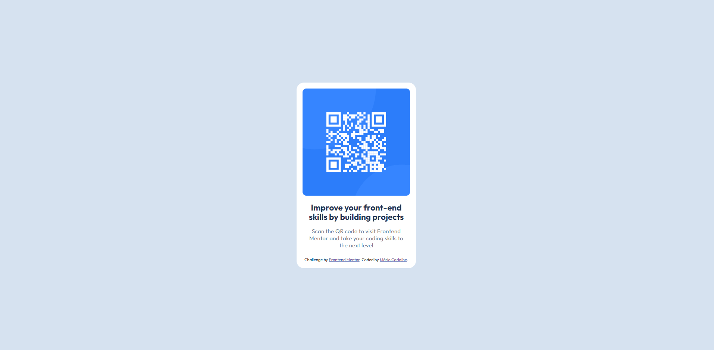

# Frontend Mentor - Solução de componente de código QR

Esta é uma solução para o [desafio de componente de código QR no Frontend Mentor](https://www.frontendmentor.io/challenges/qr-code-component-iux_sIO_H). Os desafios do Frontend Mentor nos ajudam a melhorar suas habilidades de codificação construindo projetos realistas.

## Índice

- [Captura de tela](#captura de tela)
- [Criado com](#criado-com)
- [O que aprendi](#o-que-aprendi)
- [Desenvolvimento contínuo](#desenvolvimento-contínuo)
- [Autor](#autor)
- [Agradecimentos](#agradecimentos)

### Captura de tela

[]

### Criado com

- Marcação HTML5 semântica
- Propriedades personalizadas CSS
- Flexbox
- Fluxo de trabalho mobile-first
- Figma

### O que aprendi

Mesmo um projeto simples, é importante pensar bem no que vamos fazer antes de começar a codar. Aprendi que projetos simples tem muito a ensinar.

### Desenvolvimento contínuo

Pretendo continuar aprendendo mais arrespeito de formatação de texto e espaçamento entre os paragrafos.

## Autor

- Mentor de front-end - [@MarioCarlaibe](https://www.frontendmentor.io/profile/MarioCarlaibe)
- GitHub - [MarioCarlaibe](https://github.com/MarioCarlaibe)

## Agradecimentos

Gostaria de agradecer o devemdobro pelo curso muito instrutivo que estou tendo, graças a eles pela boa didática e instrução que consegui resolver esse projeto.
